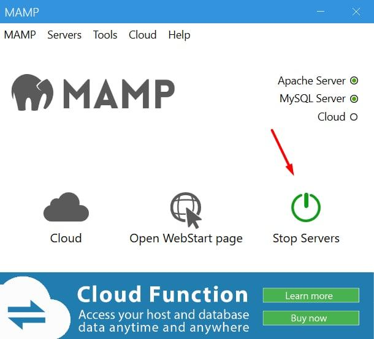

# kazan-safe-city

Мы представляем сервис по детекции мусора на дорогах и заполненности мусорных баков и прототипы других сервисов по данным с городских камер уличного видеонаблюдения.

Стек решения: python, YOLO v4, Node.js, MySQL, jquery. 

Уникальность: сервис собирает статистику по социально-значимым категориям, способствует быстрому реагированию на возникшие проблемы и позволяет утилизировать выезды служб с максимальной эффективностью.

Готовность кода: загружен блокнот с демонстрацией возможностей обученной нами нейросети + прототипом инновационной идеи (оригинал можно потыкать [вот тут](https://colab.research.google.com/drive/1LmyxJ_Iw7oBvdloJ4mQ4XOzqbSvL2E_J#scrollTo=eF32itPA5tQH)). Приведен код сайта для регистрации заявок. 
Планируется: загрузка блокнота с полной реализацией поиска мусорных баков и инновационных идей

Команда RandomName123
tg: @danila.psarev

-------
Ссылки на необходимые модели и датасеты для запуска:
1) Обученная нами Yolo(v4) ([веса](https://drive.google.com/file/d/142cfyQvu-TBshoNDFHg8wA4Tu09tQS7x/view?usp=sharing), [конфиг](https://drive.google.com/file/d/1XrCOuRW_1hXxTDCACo4sB4yn610n40-O/view?usp=sharing) и [классы](https://drive.google.com/file/d/16yQydO6YRk_6Pte2jYgsjwi1ziLmIfWD/view?usp=sharing))
2) Обученная AlexeyAB Yolo(v4) на MS COCO (все вместе [тут](https://drive.google.com/drive/folders/1myqcAWoi_2dBmUax6LYcs_A9yMrPRFG1?usp=sharing))
3) Картинки для тестов [тут](https://drive.google.com/drive/folders/1ZRBzBZ3Qd_Cl4rcRlgjXzpOtiVvNIUsm)

Сайт (вот его ) работает на локальном сервере. Для запуска необходимо установить программу, которая позволяет запустить сервер на ПК. В моём случае была использована программа MAMP, для windows можно использовать open server.
У каждой программы свои настройки. Например, в моём случае, чтобы запустить сайт необходимо было добавить все файлы сайта в папку программу htdocs и запустить сервер. Дальше он будет доступен по адресу localhost. Подключение к базе данных настроено под моими локальными параметрами (забитыми по стандарту).
По стандарту запускается файл index.html. Чтобы посмотреть сайт с его начала необходимо перейти по адресу localhost/login.html
